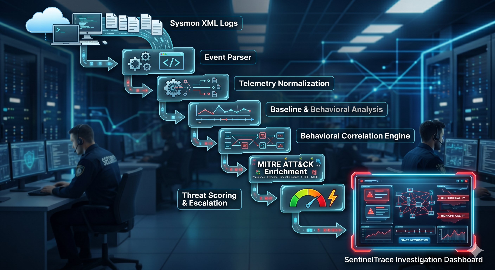
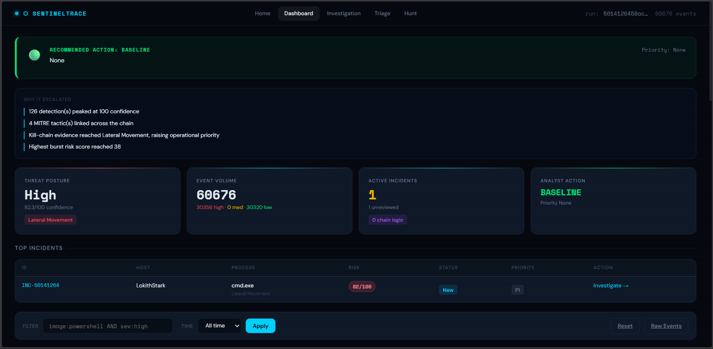
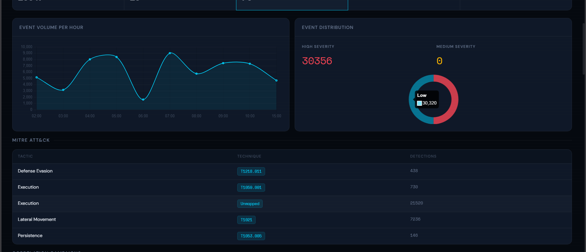
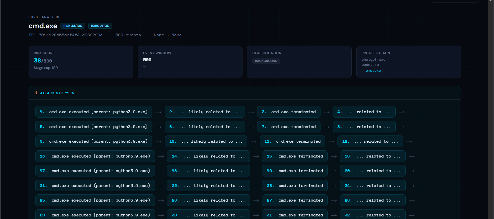
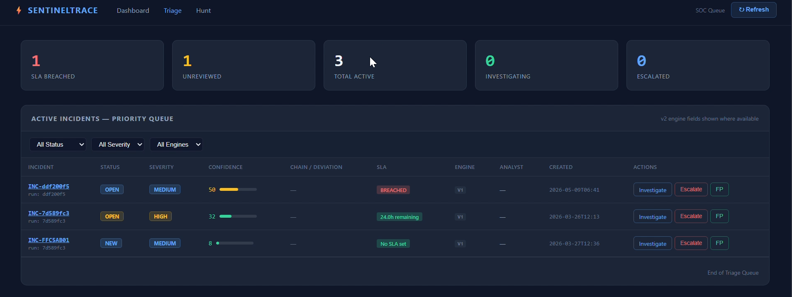

# SentinelTrace Platform

SOC-focused endpoint telemetry analysis and threat hunting platform built using Sysmon event logs, behavioral correlation, MITRE ATT&CK mapping, and investigation-oriented analytics.

---

# Overview

SentinelTrace is a cybersecurity-focused investigation platform designed to analyze historical Sysmon telemetry and reconstruct suspicious activity chains through behavioral correlation, threat scoring, and ATT&CK-aligned analytics.

The platform focuses on:

- endpoint telemetry analysis
- attack timeline reconstruction
- campaign correlation
- LOLBIN detection
- analyst-oriented investigation workflows
- baseline-aware threat scoring

Rather than acting as a traditional SIEM ingestion pipeline, SentinelTrace is designed as an offline threat hunting and forensic investigation environment for SOC-oriented workflows.

---

# Core Features

## Sysmon Telemetry Analysis

- Parses Windows Sysmon XML logs
- Extracts process, network, parent-child, and command-line activity
- Normalizes endpoint telemetry for investigation workflows

---

## Behavioral Correlation Engine

- Correlates suspicious event sequences
- Detects behavioral attack chains
- Links related telemetry into investigation campaigns

### Examples

- Encoded PowerShell execution
- LOLBIN abuse
- Suspicious parent-child process chains
- Lateral movement indicators
- Persistence behavior

---

## MITRE ATT&CK Mapping

- Maps telemetry into ATT&CK tactics and techniques
- Context-aware enrichment for:

  - PowerShell
  - cmd.exe
  - rundll32
  - schtasks
  - regsvr32
  - Remote execution patterns

---

## Threat Scoring & Escalation

- Baseline-aware scoring
- Contextual execution weighting
- Behavioral escalation logic
- False-positive reduction mechanisms

---

## Threat Hunting Dashboard

Interactive SOC-oriented investigation dashboard featuring:

- Threat posture overview
- Campaign correlation
- Attack timeline reconstruction
- ATT&CK analytics
- Process investigation
- Escalation reasoning
- Threat triage workflows

---

## LOLBIN & Command Analysis

Detects suspicious use of:

- PowerShell
- cmd.exe
- rundll32
- regsvr32
- WMI
- Encoded commands
- Suspicious command-line execution patterns

---

# Architecture



```text
Sysmon XML Logs
        ↓
Event Parser
        ↓
Telemetry Normalization
        ↓
Baseline & Sequence Analysis
        ↓
Behavioral Correlation Engine
        ↓
MITRE ATT&CK Enrichment
        ↓
Threat Scoring & Escalation
        ↓
SOC Investigation Dashboard
```

---

# Screenshots

## Main Dashboard



---

## MITRE ATT&CK Mapping



---

## Threat Investigation



---

## Hunt Console



---

# Repository Structure

```text
dashboard/          Core platform source code
tools/              Validation and calibration tooling
docs/               SQL setup scripts and architecture docs
screenshots/        Dashboard screenshots
```

---

# Technology Stack

| Component | Technology |
|---|---|
| Backend | Python |
| Framework | Flask |
| Frontend | HTML / CSS / JavaScript |
| Data Processing | Pandas |
| Telemetry Source | Sysmon |
| Threat Mapping | MITRE ATT&CK |
| Detection Logic | Behavioral Correlation |

---

# Installation

## Clone Repository

```bash
git clone https://github.com/lokilokith/sentineltrace-platform.git
cd sentineltrace-platform
```

---

## Create Virtual Environment

```bash
python -m venv .venv
```

### Windows

```bash
.venv\Scripts\activate
```

### Linux / macOS

```bash
source .venv/bin/activate
```

---

## Install Dependencies

```bash
pip install -r requirements.txt
```

---

# Running the Platform

```bash
python dashboard/app.py
```

Open:

```text
http://127.0.0.1:5000
```

---

# Example Workflow

1. Upload Sysmon XML logs
2. Parse and normalize telemetry
3. Run behavioral correlation
4. Generate ATT&CK mappings
5. Build campaign relationships
6. Escalate suspicious activity
7. Investigate findings through dashboard workflows

---

# Validation & Calibration

The repository includes:

- forensic calibration tooling
- orchestration validation
- threat scoring calibration
- behavioral validation workflows

Located in:

```text
tools/
```

---

# Current Capabilities

- Offline Sysmon analysis
- Threat hunting workflows
- Campaign reconstruction
- MITRE ATT&CK enrichment
- Timeline reconstruction
- Behavioral threat scoring
- LOLBIN analysis
- Investigation-oriented analytics

---

# Known Limitations

- Offline analysis only
- Not designed for realtime telemetry ingestion
- Requires Sysmon-generated XML telemetry
- Educational and research-focused platform
- Not intended as an enterprise-scale SIEM replacement

---

# Future Improvements

Potential future enhancements:

- Sigma rule integration
- Multi-host telemetry correlation
- Enhanced DFIR workflows
- Expanded ATT&CK enrichment
- Threat intelligence integration

---

# Educational Purpose

This project was developed as a SOC-focused cybersecurity engineering and threat hunting platform for learning:

- Detection engineering
- Endpoint telemetry analysis
- Behavioral analytics
- MITRE ATT&CK mapping
- Threat investigation workflows

---

# License

This project is released for educational and portfolio purposes.
